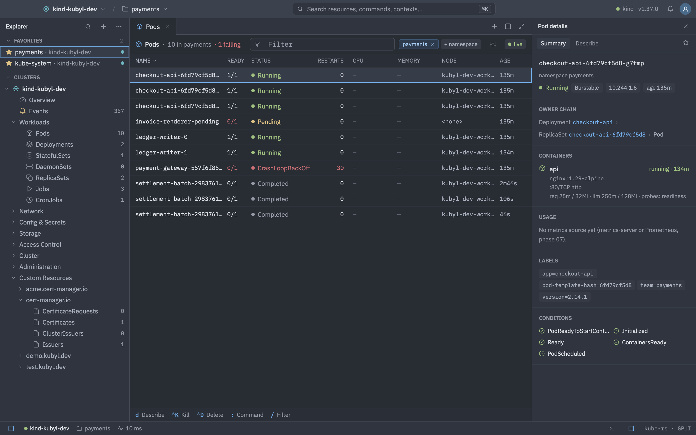
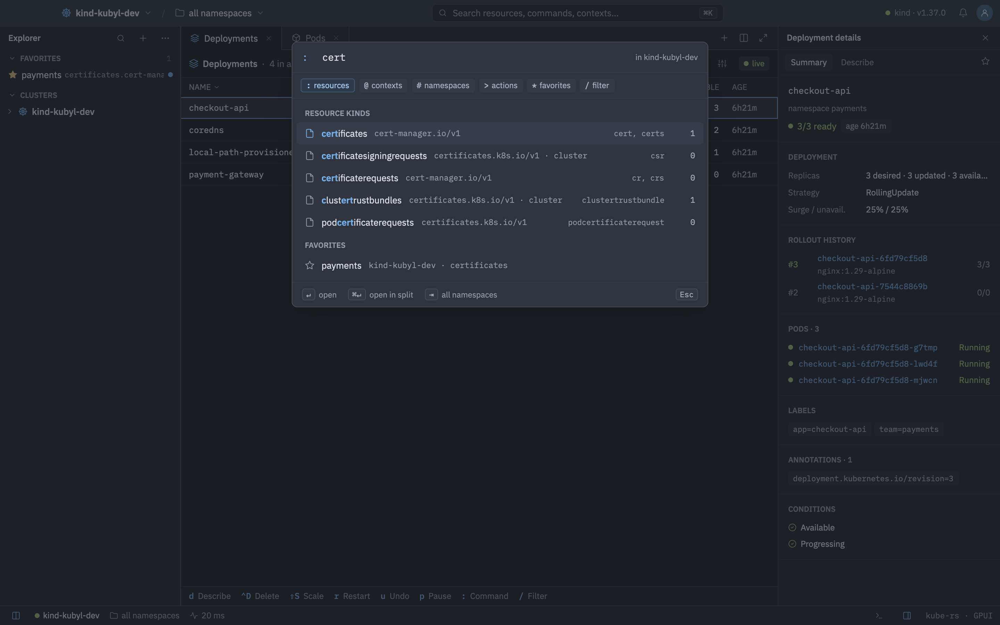
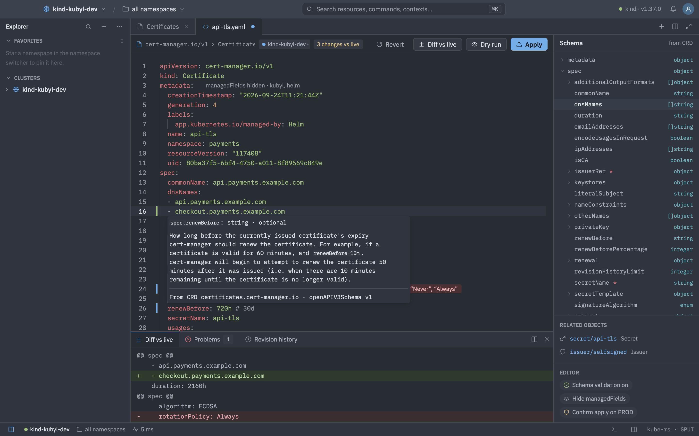
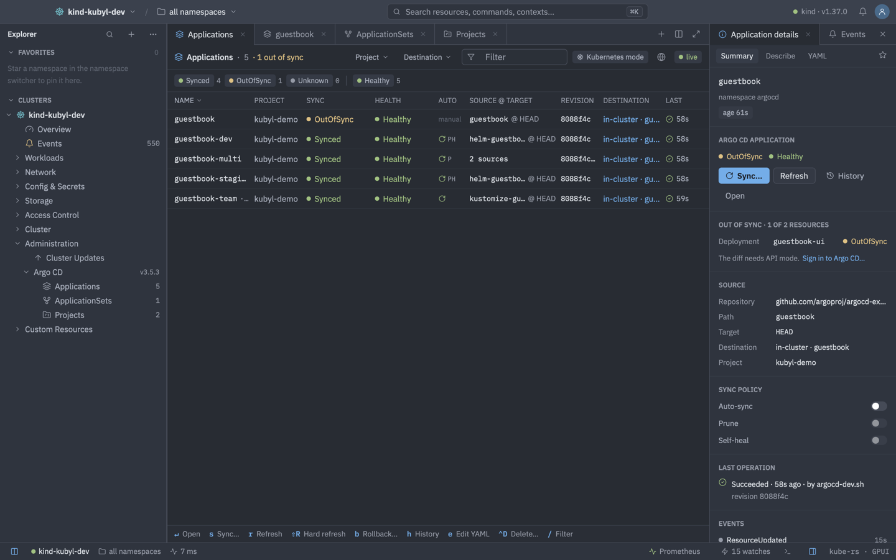
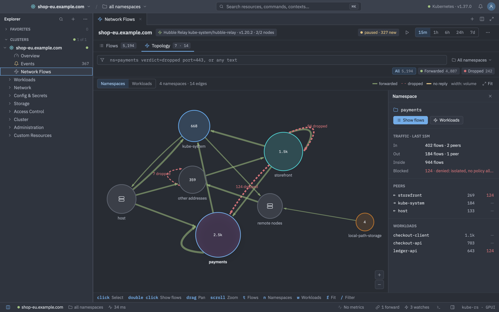

<p align="center">
  
</p>

<p align="center">
  <strong>Every cluster, two keystrokes away.</strong><br>
  A native Kubernetes desktop client for macOS, Windows and Linux, written in Rust on
  <a href="https://gpui.rs">GPUI</a> and styled like <a href="https://zed.dev">Zed</a>.
</p>

<p align="center">
  <a href="https://kubyl.dev">Website</a> ·
  <a href="https://kubyl.dev/docs">Docs</a> ·
  <a href="https://kubyl.dev/download">Download</a> ·
  <a href="CHANGELOG.md">Changelog</a> ·
  <a href="https://github.com/BirknerAlex/kubyl/issues">Issues</a> ·
  <a href="https://github.com/sponsors/BirknerAlex">Sponsor</a>
</p>

<p align="center">
  <a href="https://github.com/BirknerAlex/kubyl/actions/workflows/ci.yml"></a>
  <a href="https://github.com/BirknerAlex/kubyl/releases/latest"></a>
  
  <a href="https://github.com/sponsors/BirknerAlex"></a>
</p>



Kubyl is free for everyone, companies included. It covers what k9s and the Kubernetes Dashboard
do, plus selected OpenShift console features, in a fast, keyboard-first native window.

## Features

- **Command palette** (`⌘K` / `Ctrl+K`) with prefixes for resources, contexts, namespaces,
  actions, favorites and filters. Keymaps for the default layout and for k9s users.
- **Live resource tables** backed by watches, fast with 5,000+ pods. Favorites, split panes,
  owner chains and a details panel for every kind, custom resources included.
- **YAML editor** with schema validation against the cluster's OpenAPI spec, diff and apply.
- **Logs, shell and port-forwarding**, plus web views that open a Service in the app over a
  temporary port-forward.
- **Pod file browser** with drag and drop uploads and downloads.
- **Cluster overview** with Prometheus or metrics-server metrics, CPU and memory sparklines and
  events.
- **Argo CD**: applications, ApplicationSets, projects, resource trees, sync, history, rollback.
- **Operators (OLM v0 and v1) and Helm releases**: OperatorHub, installs, upgrades, values and
  manifests.
- **Cluster updates** for OpenShift, EKS, GKE, AKS, k3s and self-managed clusters, with
  pre-flight checks.
- **Alerts**: Alertmanager alerts, silences and alerting rules.
- **Network flows** from Cilium/Hubble, NetObserv and Calico/Whisker, as a table and a
  topology graph.
- **Kubeconfig editor** for clusters, credentials and contexts, with a connection test. Merges
  multiple kubeconfigs and supports OIDC sign-in and exec plugins (EKS, GKE, …).
- **Secrets stay safe**: tokens live in the OS keychain and are never logged or written to
  settings.

<table>
  <tr>
    <td></td>
    <td></td>
  </tr>
  <tr>
    <td></td>
    <td></td>
  </tr>
</table>

## Install

Kubyl is available through Homebrew, winget, apt, dnf and pacman, or as a direct download for
macOS, Windows and Linux. Every release ships `SHA256SUMS`. See
[kubyl.dev/docs/installation](https://kubyl.dev/docs/installation) for the commands, or grab a
build from [kubyl.dev/download](https://kubyl.dev/download) or the
[releases page](https://github.com/BirknerAlex/kubyl/releases/latest).

Usage, settings and keyboard shortcuts are documented at [kubyl.dev/docs](https://kubyl.dev/docs).

## Build from source

You need Rust 1.98 or newer (`rust-toolchain.toml` pins it for rustup).

```sh
git clone https://github.com/BirknerAlex/kubyl
cd kubyl
cargo run --release -p kubyl
```

On Linux, install the system libraries first (Debian/Ubuntu names, as in CI):

```sh
sudo apt-get install -y pkg-config clang \
  libwayland-dev libxkbcommon-dev libxkbcommon-x11-dev \
  libx11-dev libx11-xcb-dev libxcb1-dev libxi-dev libxrandr-dev \
  libfontconfig1-dev libfreetype-dev \
  libvulkan-dev libasound2-dev libzstd-dev libssl-dev \
  libwebkit2gtk-4.1-dev libgtk-3-dev
```

The cloud update providers are off by default; enable them with
`--features updates-eks,updates-gke,updates-aks`.

### Development

```sh
cargo fmt --all
cargo clippy --workspace --all-targets -- -D warnings
cargo test --workspace
cargo deny check
```

Dev builds on macOS aren't signed with the provisioning profile the data protection keychain
needs, so they trigger keychain prompts. Use a different credential store while developing:

```sh
KUBYL_CREDENTIAL_STORE=file cargo run -p kubyl    # plain text on disk, dev only
KUBYL_CREDENTIAL_STORE=memory cargo run -p kubyl  # forgotten when the app quits
```

If you use Zed, [`.zed/tasks.json`](.zed/tasks.json) has a task for this:

```jsonc
// Zed run configurations for this project.
// See: https://zed.dev/docs/tasks
[
  {
    "label": "Run kubyl (file credential store, dev only)",
    "command": "cargo run -p kubyl",
    "env": {
      "KUBYL_CREDENTIAL_STORE": "file"
    },
    "use_new_terminal": false,
    "allow_concurrent_runs": false,
    "reveal": "always"
  }
]
```

`script/` has helpers that start local [kind](https://kind.sigs.k8s.io) clusters with sample
workloads, Prometheus, Alertmanager, Argo CD, OLM, OIDC and network flow backends. Point
`KUBECONFIG` at a scratch file so your `~/.kube/config` stays untouched. See
[AGENTS.md](AGENTS.md) for the full list, screenshot tooling and known gotchas.

### Project layout

The app is a Cargo workspace. `crates/kubyl` is the binary and app shell; every feature lives in
its own crate (`kubyl_explorer`, `kubyl_yaml`, `kubyl_logs`, `kubyl_argocd`, `kubyl_netflow`, …)
and plugs in through the registries in `kubyl_core`. [plans/README.md](plans/README.md)
describes the architecture, the conventions and which crate owns what.

## Contributing

**Contributions are more than welcome!** Bug reports, feature ideas, docs, screenshots of
clusters we don't test on, and pull requests all help.

- Found a bug or have an idea? [Open an issue](https://github.com/BirknerAlex/kubyl/issues).
- Want to write code? Pick an issue (or open one to discuss a bigger change first), read
  [plans/README.md](plans/README.md) and [AGENTS.md](AGENTS.md), and send a pull request.
- Keep commits small and logical. CI runs rustfmt, clippy, tests on macOS, Windows and Linux,
  and `cargo deny`; please make sure it passes.
- A few hard rules: no network or blocking calls on the UI thread, never log or persist tokens
  or Secret data, and no GPL crates from Zed (`editor`, `workspace`, `terminal_view`, …).
- New UI should match the [mockups](https://claude.ai/artifact/VfLbzAtjsCjQJgVM1cEW4H)
  (source: `design/mockups/generate.py`).

Before your first pull request is merged, you sign the
[Contributor License Agreement](https://kubyl.dev/cla) once, on kubyl.dev with your GitHub
account; the `CLA` check on your pull request links there. You keep the copyright in your work;
the CLA grants the license the project needs to ship it. Contributions are licensed as below
and under the CLA.

## Sponsoring

Kubyl is free, and every feature stays free for everyone. If it saves you time, please consider
[sponsoring on GitHub](https://github.com/sponsors/BirknerAlex). Sponsorships pay for the Apple
Developer Program (notarization), Windows code signing, the domain and hosting; anything above
that buys development time.

Any amount helps. More on [kubyl.dev/sponsor](https://kubyl.dev/sponsor).

## License

Licensed under either of

- Apache License, Version 2.0 ([LICENSE-APACHE](LICENSE-APACHE))
- MIT license ([LICENSE-MIT](LICENSE-MIT))

at your option.

Built by [Alexander Birkner](https://birkner.io).
